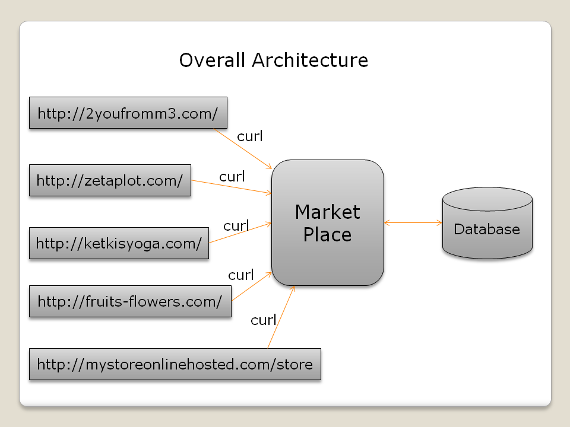

# CMPE272Project_MarketPlace
The website was created as a project requirement for CMPE272

## Cross Domain Online Market Place
Online Market Place aggregate products from different vendors(Individual sites of team members).

## Architecture

## Video Demo: ::
https://youtu.be/6K_6x4uI8ck

## Features
* User Creation and Login
* Recently Visited Products for each member company and MarketPlace using cookies
* Add review and rating for all products
* Most visited products in each member company and MarketPlace
* Top rated products in each member company and MarketPlace
* Facebook Login
* Add to Cart
* Dynamic Product Display using curl

## Future Scope
* Providing checkout functionality.
* Adding other login API’s.

## Team Members
* Praneetha reddy Devireddy (Individual site: https://www.fruits-flowers.com )
* Ketki Bhusari
* Kshama nidhi
* Anubha Mandal
* Lakshmi Bharatula 